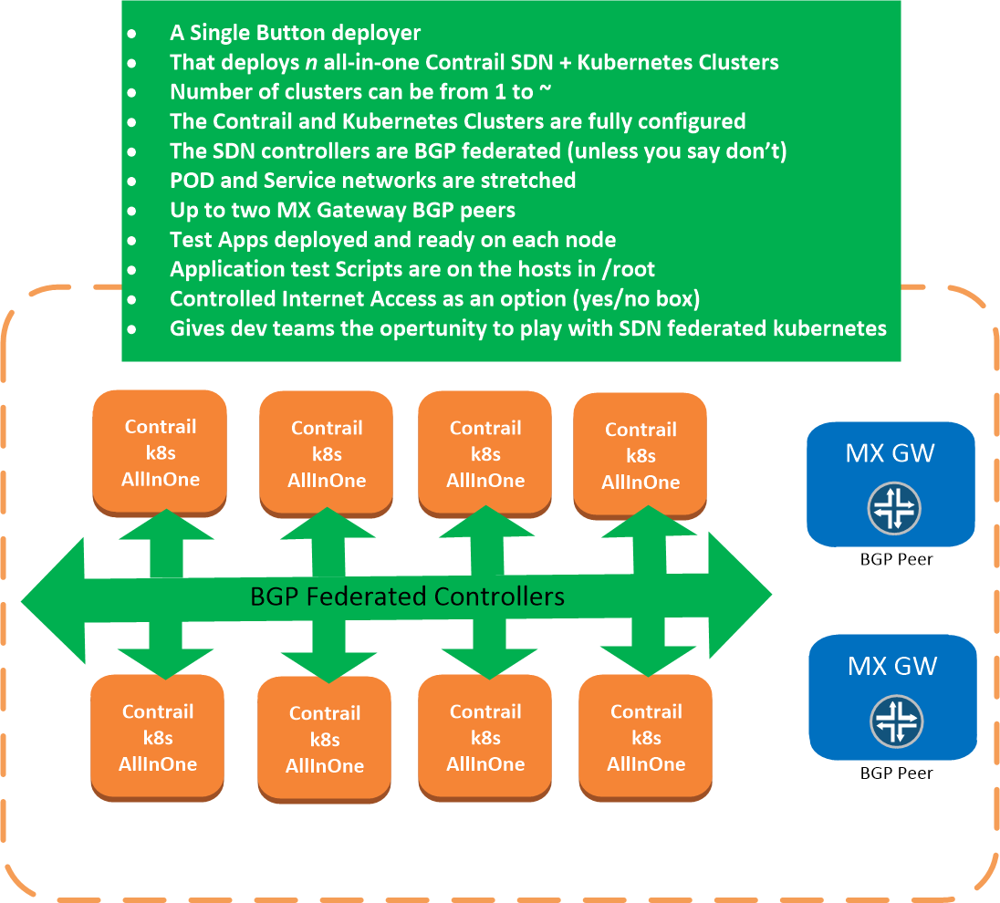
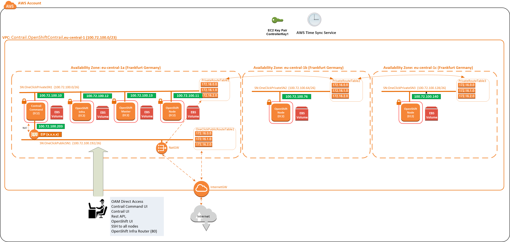
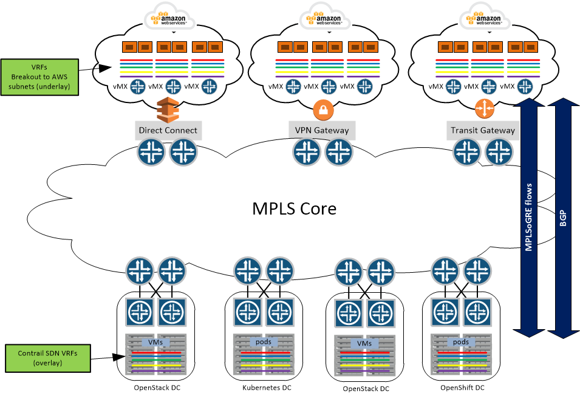

A collection of AWS Architectures and automation code that deploy them     
    
Many of these use Tungston Fabric or Contrail as the SDN. The associated config can be removed if SDN is not your thing.     
  
You will find automations in here for Native Kubernetes, OpenShift, Rancher, OpenStack    
  
Lots and Lots of AWS CloudFormation stack examples in here.    
    
note: Tungston Fabric is the OpenSource version of Contrail. Contrail requires a license and login password parameters to be set, in order to download the licensed SW.   
note: OpenShift automations require a Red Hat account in order to download the Software  
  
The stacks are all in directory /deployers  
The git root and cli* contains exmaple bash scripts for running up the stacks.   
  

----------  
----------
Federation: Moving beyond one Kubernetes cluster with tungsten-fabric/Contrail SDN
----------
----------

[Click to explore Kubernetes cluster federation using SDN ](wikis/Federation:-Moving-beyond-one-Kubernetes-cluster-with-Contrail-SDN.md)

----------
----------
tungsten-fabric/Contrail+Red Hat OpenShift
----------
----------

[Click to deploy a Red Hat OpenShift with tungsten-fabric/Contrail as the CNI. Worker nodes across multiple AWS VPC's and availability zones ](wikis/Contrail-as-the-CNI-for-Red-Hat-OpenShift.md)

----------
----------
Stretching on premise tungsten-fabric/Contrail VRFs out to AWS using a vMX
----------
----------

[Click to stretch your on premise SDN network out to AWS native services](wikis/Stretching-on-premise-Datacenter's-running-contrail-SDN-out-to-AWS-native-EC2-instances-using-vMX's-as-SDN-gateways.md)

High Level

---------
----------

[Exposing a k8minion, load balanced and scalable app to internet without an SDN gateway (no MX,vMX)](wikis/Exposing-a-k8minion-load-balanced-and-scalable-app-to-internet-without-an-MX-gateway.md)

