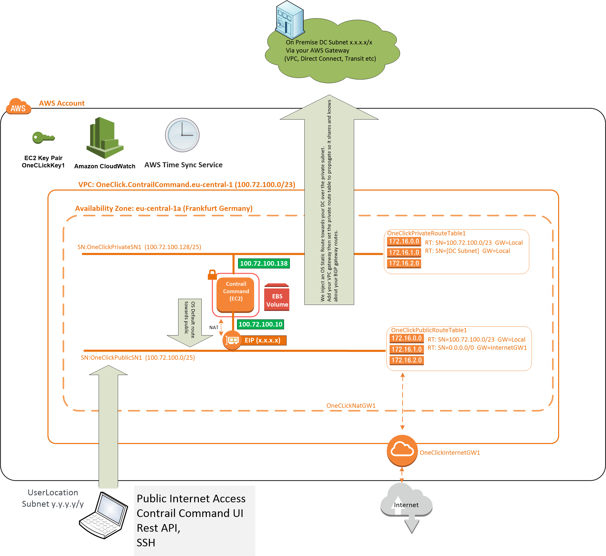
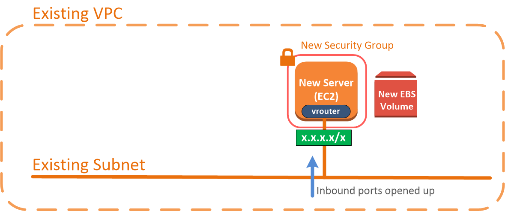

A collection of AWS Architectures and automation code that deploy them   
  
Many of these use Tungston Fabric or Contrail as the SDN. The associated config can be removed if SDN is not your thing.   

You will find automations in here for Native Kubernetes, OpenShift, Rancher, OpenStack  
  
note: Tungston Fabric is the OpenSource version of Contrail. Contrail requires a license and login password parameters to be set, in order to download the licensed SW. 
note: OpenShift automations require a Red Hat account in order to download the Software

----------  
----------
Federation: Moving beyond one Kubernetes cluster with Contrail SDN
----------
----------

[Click to explore Kubernetes cluster federation using SDN ](wikis/Federation:-Moving-beyond-one-Kubernetes-cluster-with-Contrail-SDN)

----------
----------
Contrail+Red Hat OpenShift
----------
----------

[Click to deploy a Red Hat OpenShift with Contrail as the CNI. Worker nodes across multiple AWS VPC's and availability zones ](wikis/Contrail-as-the-CNI-for-Red-Hat-OpenShift)

----------
----------
Contrail+Kubernetes in HA
----------
----------

[Click to deploy an HA Contrail controller cluster (or a simplex cluster) across three AWS availability zones: Then use Contrail Command to configure them](wikis/Contrail-HA-Controller-Cluster-Within-AWS)

----------
----------

[Click to deploy a VPC with three AWS based Minions to use with your HA Controller applications, deployed across three AWS availability zones: Then use Contrail Command to configure](wikis/Stack-to-deploy-a-Minion-VPC-Within-AWS)

----------
----------
Contrail+OpenStack All-in-One using Contrail Command
----------
----------

[Click to deploy an OpenStack All in One using Contrail Command](wikis/Deploy-a-simple-OpenStack-test-setup-into-AWS-with-Contrail-Command)

----------
----------
Adding a vMX SDN gateway to our AWS based All-in-one OpenStack using a CloudFormation stack. Then configuring with Contrail Fabric Manager
----------
----------

[Click to add a vMX to our AWS based All-in-one OpenStack ](wikis/Brownfield:-Adding-a-vMX-into-AWS,-then-using-Contrail-Command-Fabric-manager-to-configure-it-as-an-SDN-Gateway)

----------
----------
Stretching on premise Contrail VRFs out to AWS using a vMX
----------
----------

[Click to stretch your on premise SDN network out to AWS native services](wikis/Stretching-on-premise-Datacenter's-running-contrail-SDN-out-to-AWS-native-EC2-instances-using-vMX's-as-SDN-gateways)

High Level

----------
----------
Customer specific stacks 
----------
----------

[Click to deploy  Contrail Command within AWS](wikis/aws-one-click-deployer-Contrail-Command-Within-AWS)

---------
----------
[Click to deploy an on premise emulation in AWS: Use Contrail Command to build a simple all in one Contrail SDN plus Kubernetes](wikis/aws-one-click-deployer-Bare-Metal-DC-Emulation:-contrail-and-Kubernetes-all-in-one-built-with-contrail-command)

---------
----------

[Click to deploy an on premise emulation in AWS: Use Contrail Command to build a complex three VPC Contrail SDN plus Kubernetes plus multi cloud gateways](wikis/Aws-one-click-deployer-Bare-Metal-DC-Emulation:-contrail-and-kubernetes-in-multiple-VPCs-with-multi-cloud-gateways,-built-with-contrail-command)

---------
----------

[Exposing a k8minion, load balanced and scalable app to internet without an SDN gateway (no MX,vMX)](wikis/Exposing-a-k8minion-load-balanced-and-scalable-app-to-internet-without-an-MX-gateway)

---------
----------

**Brown Field Site: This stack will deploy a server into any VPC and Subnet, prepare it for contrail comand**
 
**Then the server can be defined in the Contrail Command UI as a vRouters and K8minion. Steps are provided**
 
 **This is a useful stack for customers who have their own transmission built up in AWS (Direct connect GW, Transit GW, VPC gateway etc.). So cannot use the Multi Cloud deployer which focuses on using MCGWs today**
 

[Add a server into any existing aws vpc and subnet, then configure it as a k8s minion into an existing cluster using the contrail command ui (brown field)](wikis/Add-a-Server-into-any-existing-AWS-VPC-and-Subnet,-then-configure-it-as-a-K8S-Minion-into-an-existing-cluster-using-the-Contrail-Command-UI-(brown-field))

--------
----------

**General Questions and Answers:**
1. How does it work? These single stacks simulate bare metal DCs in AWS using CloudFormation, then you Deploy Contrail etc. into that infrastructure yourself using the Contrail command UI, steps provided. The stacks prepare Contrail command for you. All stacks use Contrail 5.1 FRS code, nothing custom.
2. What software do I need to installs? Any Web browser 
3. Do I need an AWS account? yes
4. How much does it cost ? While running its approx $1 for the AllinOne $2 for the complex setup, per hour. If you stop the EC2 instances its much less. You can power them up as you need them. 
5. When I'm done how do I clean up? Just delete the CloudFormation stack in the AWS console this cleans up everything added.
6. Can I stop start the instances? Yes       
7. Can I have the code? Yes, Simply copy them directly from the AWS CloudFormation console, or pull the git repo and you have the stacks
8. Can I share the code with my customers? Yes there is nothing proprietary in these stacks. They can be shared and edited as required.
9.  Is this supported? Its a CloudFormation stack, AWS support CloudFormation.
10.  Can I use this commercially? Sorry its just to make POCs simpler and help teams show and use Contrail Command.
11.  How can my customer use this? copy and paste this wiki and send it to them. Also Right click the launch button and copy the url along with it. All of the OneClick url's are setup to work over the public internet.

[prototypes are kept here](wikis/prototypes)
