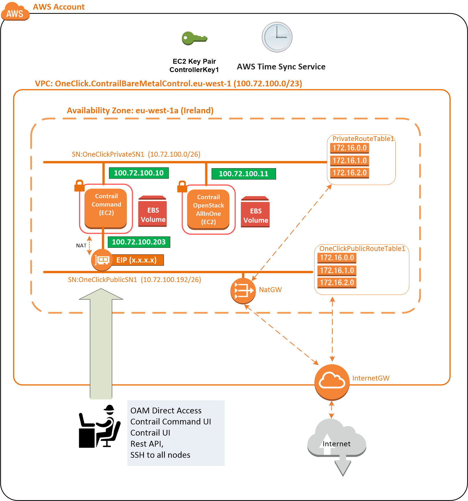
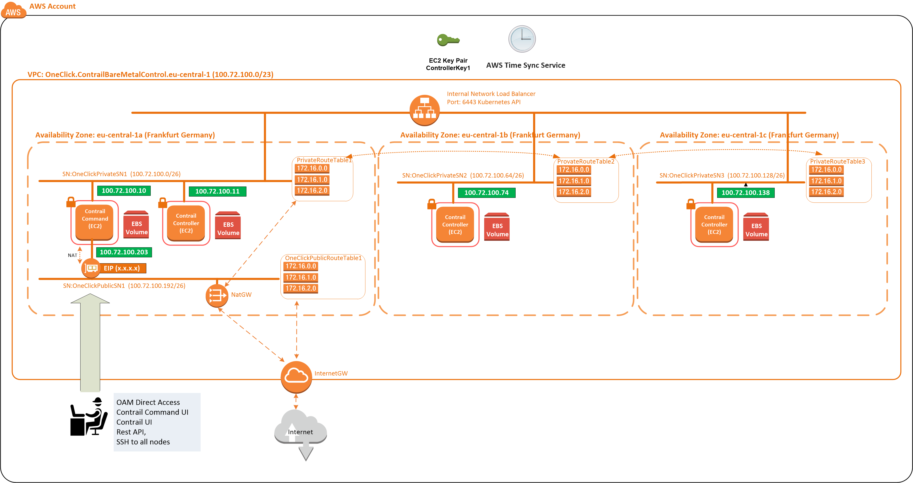

**Deploy an simple OpenStack test setup into AWS with Contrail Command**

--------------

As nested support for OpenStack computes within AWS is limited to large metal instance types (m5.metal etc.) which are very expensive. This stack uses small EC2 instances to save costs, along with QEMU emulation. So while not suitable for production workloads, its fine for OpenStack/Contrail SDN workshops. 

--------------

One Time Setup:

1. You need an AWS account. Login to the AWS console with your browser.
2. In your AWS account console you need to an EC2 SSH key pair named "ContrailKey" within the region Frankfurt
3. You might need to accept the commercial minimal CentosOS 7 free ami, The link is here (it takes ten minutes for AWS to process this)(https://aws.amazon.com/marketplace/pp?sku=aw0evgkw8e5c1q413zgy5pjce)
4.  You will need an account on the juniper contrail docker registry hub.juniper.net/contrail (user and password) in order to use our contrail SDN software.
5. you should be. able to deploy this stack in most regions of AWS, I'm using Ireland here.

How to deploy:
1.  Click this link to launch the CloudFormation stack into your account (Ireland)
[](https://console.aws.amazon.com/cloudformation/home?region=eu-west-1#/stacks/new?stackName=Contrail-OpenStack-AllInOne&templateURL=https://s3.amazonaws.com/contrail-one-click-deployers/Contrail-OpenStack-AllInOne.json)
<br/>**Note: if you right click and copy this link, then share it with your customers via email. It will work for them as well**
<br/>->NEXT
  <br/>**complete the field ContainerRegistryUserName** (this is your juniper docker registry user name)
  <br/>**complete the field ContainerRegistryPassword** (this is your juniper docker registry password)
<br/>->NEXT
<br/>->NEXT
<br/>->Deploy Stack


if you prefer to deploy using AWS cli then the command is provided below, with example values.
   ```
aws cloudformation create-stack \
  --stack-name OpenStack-AllInOne \
  --disable-rollback \
  --template-url https://s3-eu-central-1.amazonaws.com/contrail-one-click-deployers/Contrail-OpenStack-AllInOne.json \
  --parameters \
ParameterKey=ContainerRegistryUserName,ParameterValue=[your login] \
ParameterKey=ContainerRegistryPassword,ParameterValue=[your password] \
ParameterKey=SGSubnet2,ParameterValue="10.20.30.0/24" \
ParameterKey=SGSubnet3,ParameterValue="10.20.31.0/24" \
ParameterKey=SGSubnet4,ParameterValue="10.20.32.0/24" 
   ```

<br/>Note: All fields can be changed, but for the first run we suggest you go with the defaults
<br/>Note: I strongly suggest changing the stack parameter UserLocation which determines who can connect to it. If you leave it blank then we will allow access from 0.0.0.0/0, the whole of the internet.

2.  Get a coffee, it typically takes 6 minutes (3 for the stack to complete, 3 for Contrail Command to build)
3.  Once the stack completes the CloudFormation outputs tab will show you how to access the hosts, the Contrail Command UI and the OpenStack UI

What does it build: 
1.  AWS infrastructure across three availability zones, including OAM access over internet
2.  Contrail Command
2.  One bare metal server to configure with the contrail command UI, in the steps below we will build an OpenStack all in one. 

We are deploying this test setup with "DeployHighlyAvailable=false" so it will deploy without HA, as this is good enough for the workshop.



You can also set  "DeployHighlyAvailable=true" in which case it will deploy three nodes into three AWS availability zones, ready for Contrail Command to deploy as Highly Available (note: As I do not require this in the workshops I've not tested it fully with this stack yet, I have with other stacks).




**OpenStack Build steps follow:**

1.  Connect to the Contrail command UI https://[contrail-command-instance-public-ip]:9091
<br/>user=admin password=contrail123 (the CloudFormation outputs tab will give you the full OAM access links)
2.  Credentials
   ```
    -> Credentials->add
    name= centos
    ssh user= root
    ssh password= EfrtGF5EDF_d54ERrf (unless you changed the value prior to deploying)
    ->ADD
   ```
3.  Servers
   ```
    ->Servers->ADD
    name= OpenStackAllInOne
    mgmt ip= 100.72.100.11
    Interface= ens5
    Credentials= centos
    ->Create
   ```
4.  Cloud Manager
   ```
    ->Next This is the Cloud Manager Page
    Cluster Name= OpenStackAllInOne (or any name you like)
    Container Registry= hub.juniper.net/contrail  (default)
    Container Registry User Name:[your contrail registry user user name here]
    Container Registry Password:[your contrail registry password here]
    Contrail Version= 2003.33
    Domain Suffix= eu-west-1.compute.internal
    NTP Server= 169.254.169.123
    Default vRouter Gateway= 100.72.100.1
    Encapsulation Priority= MPLSoGRE,VxLAN,MPLSoUDP (We will use vMX which does not support MPLSoUDP)
   ```
5.  Control Nodes
   ```
    ->NEXT This is the  Control Nodes page
    Assign your OpenStack server by clicking the arrow (it will move to the right)
   ```
6. Orchestrator Nodes
   ```
    ->NEXT This is the Orchestrator Nodes page
    orchestrator from Openstack (default)
    Click Advanced
    Select Queens
    Kolla Global: Add variable: enable_haproxy = no
    Kolla Global: Add variable: enable_ironic = no
    Kolla Global: Add variable: enable_swift = yes
    Kolla Global: Add variable: swift_disk_partition_size = 20G
    Assign your Openstack servers by clicking the arrow (it goes to the right)
   ```
7.  Computes Nodes
   ```
   Click ->NEXT (Computes Nodes Page)
   assign your OpenStack.Gateway= 100.72.100.1
   ```
8.  Click ->NEXT This is Contrail Service Nodes. Nothing to complete here, do not assign a server.
9.  Click ->NEXT  This is the Appformix Nodes. Nothing to complete here, do not assign a server.
9.  Click ->NEXT  This is the Appformix Flows. Nothing to complete here, do not assign a server.
10. Click ->NEXT You are on the Summary Page 
11. Click ->Provision   
<br/>Your cluster will Deploy. After approx 25 minutes it should say finished successfully
<br/>Now click ->Proceed to be redirected the login page Login
<br/>This time select your cluster OpenStackkAllInOne user=admin password=contrail123 
<br/>You are done. The portal will show up in a minute of two. Go play.

**Next change to use qemu rather than kvm as these aws EC2 instances do not offer nesting:**
   ```
#connect to the openstack node (see stack outputs)
sudo bash
sed -i 's/virt_type = kvm/virt_type = qemu/g' /etc/kolla/nova-compute/nova.conf
sed -i '/virt_type = qemu/a cpu_mode = none' /etc/kolla/nova-compute/nova.conf
reboot
   ```

**Install the OpenStack client on the host using yum:**
   ```
#connect to the openstack node (see stack outputs
sudo bash
yum -y install centos-release-openstack-queens
yum -y install python-openstackclient
   ```

**Setup OpenStack and deploy some test instances:**
   ```
#Here I an using the OpenStack cli. You could also use the Horizon GUI for this, see the stack output for the link
source /etc/kolla/kolla-toolbox/admin-openrc.sh
yum -y install wget
wget http://download.cirros-cloud.net/0.4.0/cirros-0.4.0-x86_64-disk.img
openstack image create cirros2 --disk-format qcow2 --public --container-format bare --file cirros-0.4.0-x86_64-disk.img
ssh-keygen -q -t rsa -N '' -f ~/.ssh/id_rsa 2>/dev/null <<< y >/dev/null
openstack keypair create --public-key ~/.ssh/id_rsa.pub mykey
openstack network create net1
openstack subnet create subnet1 --network net1 --subnet-range 192.0.2.0/24
openstack network create net2
openstack subnet create subnet2 --network net2 --subnet-range 192.0.3.0/24
openstack flavor create --id 0 --vcpus 1 --ram 64 --disk 1 m1.nano
openstack security group rule create --proto icmp default
openstack security group rule create --proto tcp --dst-port 22 default
openstack server create --flavor m1.nano --image cirros2 --security-group default --key-name mykey --network net1 testinstance1
openstack server create --flavor m1.nano --image cirros2 --security-group default --key-name mykey --network net1 testinstance2
openstack server create --flavor m1.nano --image cirros2 --security-group default --key-name mykey --network net2 testinstance3
openstack server list
   ```

**Edit the network policies to allow them to route within the SDN:**
   ```
#ssh into the contrail command ui (see the cloudformation stack outputs) 
                                  (you can also use the tungston fabric UI)
->Overlay->Network Policies->Add
    name = PassAll
    action = Pass
    protocol = Any
    source-type = none
    source-port = any
    direction <>
    destination-type = none
    destination-ports = any
    ->save

->Overlay->Virtual Networks->net1->edit
          network-policies = PassAll
          ->save
->Overlay->Virtual Networks->net2->edit
          network-policies = PassAll
          ->save
   ```

**You can connect to the test instances as follows:**
   ```
docker exec nova_libvirt virsh list
docker exec -it nova_libvirt virsh console 1 
docker exec -it nova_libvirt virsh console 2 

#you will now be able to ping between the networks
   ```

**All Done**

How to secure OAM access:
1.  The stack parameter UserLocation determines who can connect to it. 
2.  If you leave it blank we will allow access from 0.0.0.0/0,  the whole of the internet.
3.  If you set it to your laptop ip address x.x.x.x/32 only you can connect to it, its secured within the public SG.
4.  You can also manually change the rules in the contrail command AWS security group.
 

