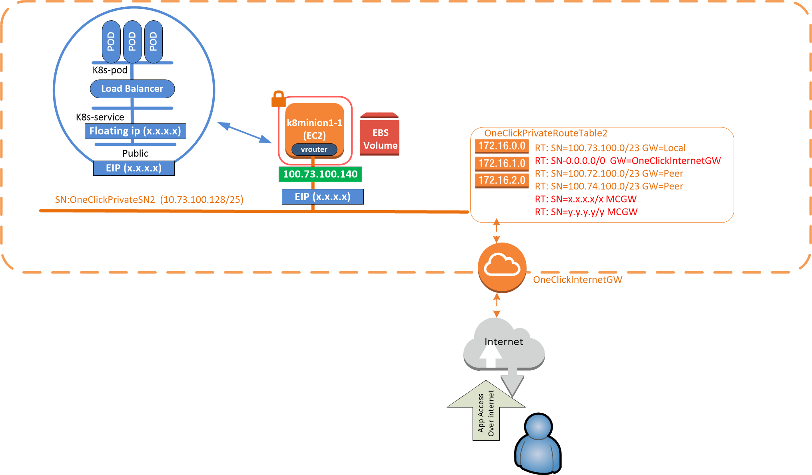

Our customer has asked how to allow inbound access from internet to apps behind a load balancers (an external load balancer build within Contrail SDN). Without an SDN GW. The apps may be spread across k8minions in different VPS. This wiki provides the steps.

Here we provide two options. 

1) To expose the overlay service network (Kubernetes service CLUSTER-IP). To the public internet, via AWS.

and/or 

2) To expose the public network (Kubernetes EXTERNAL-IP). To the public internet, via AWS.

Here we are not using the MCGW for internet access. We expose the app directly on a random minion and control the traffic with an AWS SG entry. This is well aligned with the Kubernetes documented method of exposing a service such as an external load balancer.

 **********************************************
 Base Setup: You need to have deployed the three VPC setup in the wiki, or something similar to it.
 We are assuming here that its up and running.
 **********************************************

We are in this setup limited to one EIP per minion, so a few tens of thousands of service ports per setup. Plus Linux iptables limits.

Should you need something more flexible and scalable an MX or vMX configured as an SDN gateway would be the way to go. Contrail can in this case will do the MX provisioning for you, as required.

 **********************************************
 option 1) exposing the service network to fabric
 **********************************************
 no changes are required here for 5.1, as for Kubernetes we now route the service networks from the fabric by default (look for the default route to vhost0 on the minions)

 **********************************************
 Option 2) exposing the Public and floating IP addresses to fabric
 **********************************************
 This setup is a little tougher verses the above, it will expose the Kubernetes public ip on the load balancer to internet. 
  
 *****************Docker Config for floating ip's****************
 #prior to this config you will see errors as you  expose the pod lb port with kubectl expose
 #docker exec -i -t kubemanager_kubemanager_1 tail -f /var/log/contrail/contrail-kube-manager.log
 #the external_IP will show as pending 
 #
 #on the k8master edit the contrail-kube-manager file /etc/contrail/contrail-kubernetes.conf and redeploy the kube manager as follows
 cd /etc/contrail/kubemanager
 docker-compose -f ./docker-compose.yaml down
 echo "KUBERNETES_PUBLIC_FIP_POOL={'domain': 'default-domain', 'project': 'k8s-default', 'network': 'public', 'name': 'default'}">> /etc/contrail/common_kubemanager.env
 docker-compose -f ./docker-compose.yaml up -d
 **********************************************

 **Now setup a public network and floating addresses**
 
 Use the contrail UI on port 8143
 
 
 **select project k8s-default at the top**
 configure->networking->networks
      ->+ 
     name=public
     policy=k8s-default-ip-fabric-np
     subnet=10.20.40.0/24 10.20.40.10-10.20.40.100 (note IPAM does not work here)
     advanced->
         ->external=tick. (its this one that creates the floating ip pool)
     ->save
  
 in configure->networking->Floating IP Pools you will notice you already have a default pool with the publicNetwork1 subnet assigned.
 
 configure->networking->floating ip
      ->+
      Floating ip pool=publicNetwork1
      allocation type=dynamic
      number of ip addresses=5
 

 **********************************************
 Deploy a test app with a load balancer
 **********************************************

 ssh into the k8master (see the output tav of your CloudFormation stack)
 sudo bash
 yum install -y git
 kubectl run bootcamp --image=docker.io/jocatalin/kubernetes-bootcamp:v1 --port=8080
 kubectl expose deployment/bootcamp --type="LoadBalancer" --port 8080
 kubectl scale deployments/bootcamp --replicas=6
 kubectl get pods --all-namespaces=true -o wide
 kubectl get services  
 In the output here you will see s Cluster IP(service ip) and an External-IP(public floating ip)     
 NAME         TYPE           CLUSTER-IP      EXTERNAL-IP   PORT(S)          AGE
 bootcamp     LoadBalancer   10.104.184.154   10.20.40.15   8080:31350/TCP   63m **********************************************

enable metrics on the vrouters so we can see the security flows
 Using the contrail UI on port 8143
 Configure>Global Config->Forwarding Options> Edit
 Set "Session Export Rate/secs" to "-1" "

 **********************************************
 tell the Kubernetes minion to forward inbound traffic to the service ip or the public ip of the app (your choice)
 **********************************************
 
 you will need to change the ip's in the example below to match your "kubectl get services" output. 
 
 Note: In this example nat rule
  100.73.100.140 is the minion vhost0. 
  10.20.40.15 is the EXTERNAL-IP
  10.110.51.97 is the CLUSTER-IP
 
 **MCGW11 Examples:**
 This one forwards port 8080 to the EXTERNAL-IP (public floating) 10.20.40.15
 
 iptables -t nat -I PREROUTING -p tcp -d 100.73.100.140 --dport 8080 -j DNAT --to-destination 10.20.40.15:8080
 iptables -t nat -I POSTROUTING -p tcp -d 10.20.40.15 --dport 8080 -j SNAT --to-source 100.73.100.140
 iptables -I FORWARD -p tcp -d  10.20.40.15 --dport 8080 -j ACCEPT
 iptables -I FORWARD -m state --state RELATED,ESTABLISHED -j ACCEPT
 
 This one forwards port 8080 to the CLUSTER-IP (service ip) 10.110.51.97 
 
 iptables -t nat -I PREROUTING -p tcp -d 100.73.100.140 --dport 8080 -j DNAT --to-destination 10.110.51.97:8080
 iptables -t nat -I POSTROUTING -p tcp -d 10.110.51.97 --dport 8080 -j SNAT --to-source 100.73.100.140
 iptables -I FORWARD -p tcp -d  10.110.51.97 --dport 8080 -j ACCEPT
 iptables -I FORWARD -m state --state RELATED,ESTABLISHED -j ACCEPT
 
 **********************************************
 AWS changes: updating the private route tables to not use a default route out via the local MCGW
 **********************************************
 We will expose the minion to internet using an AWS SG and EIP.
 
 The private route tables currently use the local MCGW as the default route. (The private route tables are the routers for the networks tuning vRouters).
 
 We will change the default route from the local MCGW interface to the internet gateway
 I will do this for minion11, but you could do this for any minion, whether it hosts a pod or not.
 
 on the AWS Console
 Services->VPC->Route Tables
    ->OneCliclPrivateRouteTable2->Edit Routes
    Change the default route from the end interface to the NAT gateway if you have one,  the internet gateway for the VPC if you do not have a NAT gateway (see the note below in this case)
 
 this will of course stop the MCGW's from working properly, as we have told this subnet to route straight to internet. 
 If you plan to also use the MCGW's, simply add more specific routes towards any other VPC supernets or on premise supernets , into the same route table. With the local MCGW private interface, as the next hop.
 
 Now assign an EIP for minion11, to allow the public internet to find it.
 
 console>services->ec2->elastic IP address->Allocate new address
 select the new EIP address->action->allocate->Minion instance id (use the search)
 
 **AWS Note here.. if you do not have NAT gateways in your setup, you will have to do one of these things should you wish to keep traffic towards the internet running on the other instances in the same network...**
 
 1)Assign a nat gateway to the network and use that as the default route out. 
 or if you do not have or use NAT gateways
 2)After changing the route table to use an internet gateway as the default. Assign an EIP to every instance on the subnet connected to the route table.
 
 Note: on my 3 VPC setup I do not assign nat gateways to all of the private networks, as this takes us over the 5 EIP limit (to increase the limit its an AWS service ticket and a 10 minute wait).
 
 Now allow traffic into the minions you want to expose, for the port you will assign to the service.
 
 console->services->ec2->minion11->click the Security Group->Click Inbound->edit
 Add Rule->tcp, 8080,  0.0.0.0/0 , BootCamp Service
 ->save
 
 **********************************************
 testing
 **********************************************
 Now from the public internet you can reach your app on the floating ip
 Example:
curl 3.120.166.111:8080
Hello Kubernetes bootcamp! | Running on: bootcamp-56648f7df7-sqjf5 | v=1
