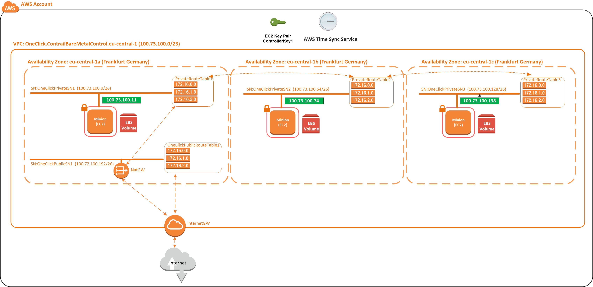

**Deploy an Minion VPC with three Minions across three AZs**

This stack follows on from the HA Contrail Controller stack. Creates some Minions to deploy applications within.

How to deploy:
1.  Click this link to launch the CloudFormation stack into your account (Frankfurt)

 **Note: if you right click and copy this link, then share it with your customers via email. It will work for them as well**
 ->NEXT
 ->NEXT
 ->NEXT
 ->Deploy Stack

2.  Get a coffee, it typically takes 4 minutes

What does it build: 
1.  AWS infrastructure VPC across three availability zones
2.  Three bare metal servers to configure with the contrail command UI as minions, steps follow.

Note: If you set "DeployHighlyAvailable=false" then it will only deploy one minion instance.

-------------------------------
-------------------------------

Next you need to peer your controller cluster VPC (previous stack) into your minions VPC (this stack), this will allow traffic to route between the two VPCs subnets. 

 We have a stack for this. Click the link to peer your VPCs. Click this link to peer the VPCs

 Click ->Next
 Populate the Contrail "Controller VPC ID". You can get this from the console Services->VPC->VPCs
 Populate the "ID of Controller VPC Private Route Table 1". You can get this from the console Services->VPC->Route Tables
 Populate the "ID of Controller VPC Private Route Table 2". You can get this from the console Services->VPC->Route Tables
 Populate the "ID of Controller VPC Private Route Table 3". You can get this from the console Services->VPC->Route Tables
 Populate the "Minion VPC ID". You can get this from the console Services->VPC->VPCs
 Populate the "ID of Minion VPC Private Route Table 1". You can get this from the console Services->VPC->Route Tables
 Populate the "ID of Minion VPC Private Route Table 2". You can get this from the console Services->VPC->Route Tables
 Populate the "ID of Minion VPC Private Route Table 3". You can get this from the console Services->VPC->Route Tables
 ->NEXT
 ->NEXT
 ->Create Stack

-------------------------------
-------------------------------
Now from the Contrail Command UI lets configure the minions:

1.  Connect to the Contrail command UI https://[contrail-command-instance-public-ip]:9091
 select the cluster id
 user=admin password=contrail123 
 The Controller CloudFormation outputs tab will give you the full OAM access links
2.  ->Servers->CREATE
     name=Minion1a
     mgmt ip=100.73.100.11
     Interface=ens3
     Credentials=centos
     ->Create
3.  ->Servers->CREATE
     name=Minion1b
     mgmt ip=100.73.100.74
     Interface=ens3
     Credentials=centos
     ->Create
3.  ->Servers->CREATE
     name=Minion1c
     mgmt ip=100.73.100.138
     Interface=ens3
     Credentials=centos
     ->Create
4.  Click ->Cluster->Cluster Nodes (tab)->Compute Nodes (tab)->Add->Computes Nodes
 click the three Minion nodes to send them to the right.
 Minion1a->Default Vrouter Gateway=100.73.100.1
 Minion1b->Default Vrouter Gateway=100.73.100.65
 Minion1c->Default Vrouter Gateway=100.73.100.129
 ->Enroll Server
 At this point Contrail Command will begin configuring the new minions. After 4-5 minutes you will see the nodes appear on the UI. 
 

-------------------------------
-------------------------------
 Patch to fix CoreDNS and pod placement:

 A default Kubernetes setup may place CoreDNS and other pods on the master node where they will fail to start. The following patch will ensure they run in SDN overlay on the k8minions. Run the following command on the k8master as root.

 Run these on controller node 3 as root

 kubectl -n kube-system get deployment coredns -o yaml | sed '/- effect\: NoSchedule/d' | sed '/key\: node-role.kubernetes.io\/master/d' | kubectl apply -f -
 kubectl taint node ip-100-72-100-11.eu-central-1.compute.internal node-role.kubernetes.io/master=true:NoSchedule
 kubectl taint node ip-100-72-100-74.eu-central-1.compute.internal node-role.kubernetes.io/master=true:NoSchedule
 kubectl taint node ip-100-72-100-138.eu-central-1.compute.internal node-role.kubernetes.io/master=true:NoSchedule
 kubectl get pods -n kube-system -oname |grep coredns |xargs kubectl delete -n kube-system

-------------------------------
-------------------------------

To check the Kubernetes node status, ssh to controller 3, "kubectl get nodes"
To check the minion router status, ssh to the minion, "contrail-status"

-------------------------------
-------------------------------

You have done amazing well to get here. Reflecting on the steps you can probably see the whole setup will only take around 20 minutes next time you deploy. Here is your final architecture.

